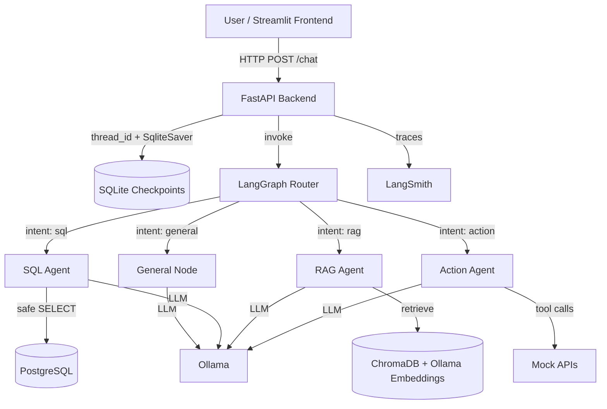

# 🤖 Dispatch AI

A production-ready multi-agent AI support system built with **LangGraph**, **FastAPI**, **PostgreSQL**, **ChromaDB**, and **Ollama**. It routes customer questions to specialized agents for knowledge-base Q&A, safe SQL queries, automated actions, and general conversation — with conversation memory, streaming responses, and observability built in.

> **Note:** This project uses local LLMs via Ollama. No paid API keys are required to run the core stack.

## Live Demo

- Chat UI: *[Streamlit app URL to be added after deployment]*
- API Docs: `http://localhost:8000/docs` (when running locally)

## Features

- **Multi-agent routing** — an LLM classifier routes each question to the right specialist agent (`sql`, `rag`, `action`, or `general`).
- **RAG-powered knowledge base** — answers policy and product questions from a markdown document collection, with source attribution.
- **Natural language to SQL** — generates safe, read-only PostgreSQL queries and returns concise natural-language summaries.
- **Automated action execution** — uses tool calling to fetch weather, send notifications, and create support tickets.
- **Conversation memory** — persists multi-turn state with `thread_id` using LangGraph's `SqliteSaver`.
- **Streaming responses** — Server-Sent Events endpoint for a typing effect in the UI.
- **FastAPI backend** — `/health`, `/chat`, `/chat/stream`, `/sessions/{id}/history`, and `/metrics`.
- **Rate limiting, CORS, and request logging** — production middleware configured out of the box.
- **Evaluation suite** — 20 test cases covering intent classification, SQL safety, RAG relevance, and action accuracy.
- **LangSmith tracing** — optional tracing by setting environment variables.
- **Docker support** — `docker-compose.yml` spins up PostgreSQL, ChromaDB, Ollama, and the FastAPI app.

## Architecture

See the full architecture write-up in [`docs/architecture.md`](docs/architecture.md).



## Tech Stack

Python 3.13 | LangGraph | FastAPI | PostgreSQL | ChromaDB | Ollama | Streamlit | Docker | LangSmith

## Evaluation Results

Run the suite yourself with:

```bash
python -m eval.run_eval
```

Latest run (`llama3.1` on a local CPU):

| Metric                       | Score    |
|------------------------------|----------|
| Intent Accuracy              | 100.0%   |
| Answer Relevance             | 90.0%    |
| SQL Generation Accuracy      | 100.0%   |
| RAG Source Grounding         | 100.0%   |
| Action Tool Accuracy         | 100.0%   |
| Error Rate                   | 0.0%     |
| Average Latency              | ~9.9s    |

## Quick Start

### Prerequisites

- Python 3.13
- [Ollama](https://ollama.com) installed and running
- [PostgreSQL](https://www.postgresql.org) running locally, or Docker

### Local Setup

1. Clone the repo and create a virtual environment:

```bash
git clone <repo-url>
cd dispatch
python -m venv venv
# Windows:
.\venv\Scripts\activate
# Linux/Mac:
source venv/bin/activate
```

2. Install dependencies:

```bash
pip install -r requirements.txt
```

3. Copy environment variables and start Postgres/Ollama:

```bash
# Linux/Mac:
cp .env.example .env
# Windows PowerShell:
Copy-Item .env.example .env

# Make sure Ollama has the required models:
ollama pull llama3.1
ollama pull nomic-embed-text
```

4. Start the FastAPI backend:

```bash
python -m uvicorn app.main:app --host 127.0.0.1 --port 8000
```

5. Open the interactive docs at `http://127.0.0.1:8000/docs`.

### Streamlit Frontend

In a new terminal:

```bash
# Windows
$env:API_URL="http://127.0.0.1:8000"
python -m streamlit run frontend/streamlit_app.py

# Linux/Mac
API_URL=http://127.0.0.1:8000 python -m streamlit run frontend/streamlit_app.py
```

Then open `http://localhost:8501`.

### Docker

> First startup pulls the Ollama models and may take several minutes.

```bash
docker compose up --build -d
```

The API will be available at `http://localhost:8000` and ChromaDB at `http://localhost:8001`.

### Running Tests

```bash
# Install dev dependencies
pip install -r requirements-dev.txt

# Linting
ruff check app frontend eval tests

# Unit tests
pytest tests -v
```

## Project Structure

```
dispatch/
├── README.md
├── .env.example
├── .gitignore
├── requirements.txt
├── requirements-dev.txt
├── docker-compose.yml
├── Dockerfile
├── .dockerignore
├── app/
│   ├── main.py              # FastAPI app + endpoints
│   ├── config.py            # Centralized pydantic-settings config
│   ├── agents/
│   │   ├── router.py        # LangGraph router + graph compile
│   │   ├── rag_agent.py     # RAG node
│   │   ├── sql_agent.py     # SQL generation + safety
│   │   ├── action_agent.py  # Tool-calling agent
│   │   └── state.py         # AgentState TypedDict
│   └── tools/
│       ├── retriever.py     # ChromaDB + Ollama RAG
│       ├── database.py      # PostgreSQL helpers
│       └── api_client.py    # Mock action tools
├── data/
│   ├── documents/           # Markdown knowledge base
│   ├── seed_data.sql        # Postgres seed data
│   └── checkpoints.sqlite   # LangGraph conversation memory
├── eval/
│   ├── test_cases.json      # Evaluation cases
│   └── run_eval.py          # Evaluation runner
├── experiments/             # Week-by-week learning scripts
├── frontend/
│   └── streamlit_app.py     # Chat UI
├── tests/                   # pytest suite
├── docs/
│   └── architecture.md      # System design docs
└── AGENTS.md                # Agent rules and dev notes
```

## Blog Post

Read the build journal: *[blog post URL to be added]*

## License

MIT — feel free to fork and adapt for your own projects.
