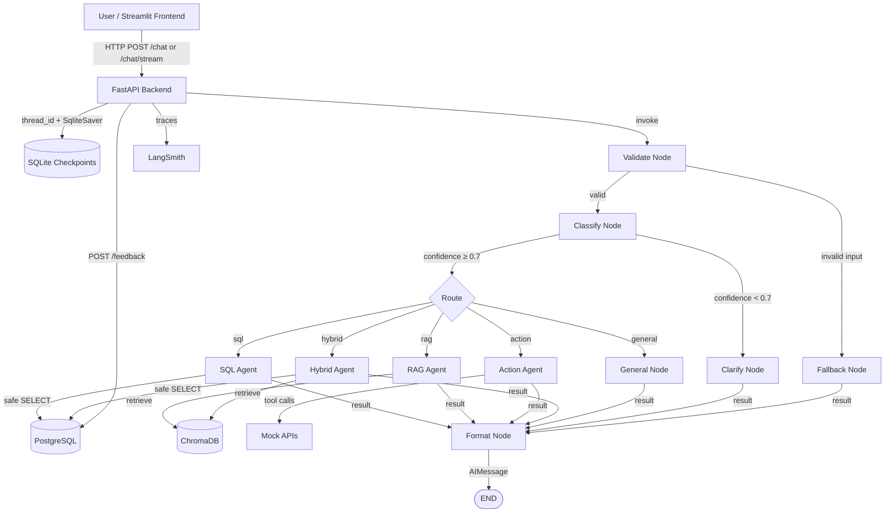

# Otto — Architecture

## System Overview

Otto is a multi-agent customer-support system. A user asks a question through the Streamlit frontend or directly via the FastAPI backend. The backend runs a LangGraph graph that validates the input, classifies intent with a confidence score, and routes the request to one of five specialist agents: SQL, RAG, action, hybrid, or general. Low-confidence classifications are routed to a clarify node that asks the user a follow-up question. Each agent calls the Groq API and the appropriate data source or tool.

## Architecture Diagram

## Component Descriptions

| Component | Responsibility |
|-----------|----------------|
| **Streamlit Frontend** | Chat UI with session persistence (URL query params), SSE streaming, example questions by category, source/SQL/data expanders, and per-message 👍/👎 feedback with optional text reason. |
| **FastAPI Backend** | Exposes `/health`, `/chat`, `/chat/stream`, `/sessions/{id}/history`, `/metrics`, and `/feedback`. Handles CORS, rate limiting, request logging, response caching, metrics aggregation, and feedback storage. |
| **Validate Node** | Rejects empty messages, messages over `MAX_INPUT_LENGTH`, and messages containing blocked keywords before any LLM call. |
| **Classify Node** | Calls the Groq classifier model (`llama-3.1-8b-instant`) with conversation history to produce an intent label and a confidence score (0–1). Uses `CLASSIFY_MODEL` for speed and cost. |
| **Clarify Node** | Triggered when classifier confidence is below `CONFIDENCE_THRESHOLD` (0.7). Generates a short clarifying question so the user can restate their intent before a specialist is invoked. |
| **SQL Agent** | Generates, validates, and executes read-only PostgreSQL queries. Formats results as a markdown table with human-readable column labels and a plain-text summary. |
| **RAG Agent** | Embeds the query, retrieves relevant knowledge-base chunks from ChromaDB, filters by cosine distance, and synthesizes a grounded answer with source titles. |
| **Action Agent** | Uses LLM tool calling to choose between weather lookup, email notification, ticket creation, ticket update, and ticket close. |
| **Hybrid Agent** | Handles questions that require both database data and policy knowledge (e.g., eligibility checks). Runs a SQL lookup and a RAG retrieval in sequence and synthesizes a combined answer. |
| **General Node** | Handles greetings, small talk, and anything outside the specialist domains using the full conversation history. |
| **Fallback Node** | Returns a safe error message for invalid or blocked input. |
| **Format Node** | Appends the specialist result as an `AIMessage` to the graph state before the graph exits. |
| **Groq API** | Hosts `llama-3.3-70b-versatile` for generation and `llama-3.1-8b-instant` for intent classification. |
| **PostgreSQL** | Stores `customers`, `orders`, `support_tickets`, and `feedback`. |
| **ChromaDB** | Vector store for the markdown knowledge base (shipping, returns, warranty, etc.). |
| **SqliteSaver** | Persists conversation state per `session_id` for multi-turn memory. |
| **LangSmith** | Optional tracing and evaluation dashboard. |

## Data Flow

1. The user sends a message to `/chat` or `/chat/stream` with a `session_id`.
2. FastAPI validates the request and invokes the compiled LangGraph with that session's checkpoint.
3. **Validate** checks the message for empty content, length violations, and blocked keywords. Invalid input goes directly to fallback.
4. **Classify** calls the fast Groq classifier model with the conversation history. It returns an intent label and a confidence score in a single two-token response (e.g., `action 0.92`).
5. If confidence is below 0.7, the **Clarify** node generates a short clarifying question and returns it to the user. Otherwise the intent routes to the matching specialist.
6. The specialist node executes:
   - **SQL**: generates a query, runs keyword safety checks, executes it against PostgreSQL, and formats results with human-readable labels.
   - **RAG**: embeds the query, searches ChromaDB, drops low-confidence chunks, and synthesizes an answer with source titles.
   - **Action**: invokes a tool (weather, notification, ticket CRUD) via LLM function calling.
   - **Hybrid**: runs SQL and RAG in sequence and synthesizes a combined answer.
   - **General**: calls the LLM directly with the full message history.
7. The **Format** node appends the result as an `AIMessage` and the graph exits.
8. The FastAPI layer returns the reply as JSON (`/chat`) or as Server-Sent Events (`/chat/stream`), including intent, confidence, sources, SQL query, and structured data.
9. The graph state is checkpointed to SQLite for multi-turn memory.
10. The Streamlit UI shows 👍/👎 buttons on each assistant reply. Ratings (and optional text reasons) are POSTed to `/feedback` and stored in PostgreSQL.
11. Endpoint metrics are updated: total requests, latency, token estimate, cost estimate, intent distribution, and feedback thumbs-up rate.

## Design Decisions and Trade-offs

- **Two-model classification** uses a small fast model (`llama-3.1-8b-instant`) for intent and a larger model (`llama-3.3-70b-versatile`) for generation. This reduces routing latency and cost without sacrificing answer quality.
- **Confidence-based clarification** avoids misrouting ambiguous requests. A threshold of 0.7 catches genuine ambiguity without triggering on clearly worded questions.
- **Hybrid agent** handles the common case where a question requires both live data and policy knowledge (e.g., "Is this customer eligible for a return?") without forcing the user to ask two separate questions.
- **Input validation before the LLM** eliminates unnecessary API calls for empty, oversized, or adversarial input.
- **SQLite conversation memory** via `SqliteSaver` is easy to deploy but not horizontally scalable; a cloud deployment would swap in a shared checkpointer store.
- **Response caching (`functools.lru_cache`)** speeds up repeated identical queries. The cache is keyed by `(message, session_id)` so context-sensitive answers are not shared across sessions.
- **SQL safety** is enforced by keyword checks before execution and a read-only query pattern. Production should also use a read-only database user and query whitelisting.
- **Session persistence via URL query params** lets users share or bookmark a conversation without requiring authentication.

## Monitoring and Observability

- **`/metrics`** returns aggregate request count, average latency, total tokens, intent distribution, cost estimate, and feedback thumbs-up rate.
- **`/feedback`** stores per-message ratings and optional text reasons in PostgreSQL for offline analysis.
- **Centralized logging** captures request durations, intents, confidence scores, and errors at each layer.
- **LangSmith** records full graph traces when `LANGCHAIN_TRACING_V2=true` and `LANGCHAIN_API_KEY` are configured.
- **`eval/run_eval.py`** runs a suite of intent, SQL, RAG, and action test cases and writes a timestamped results JSON.
