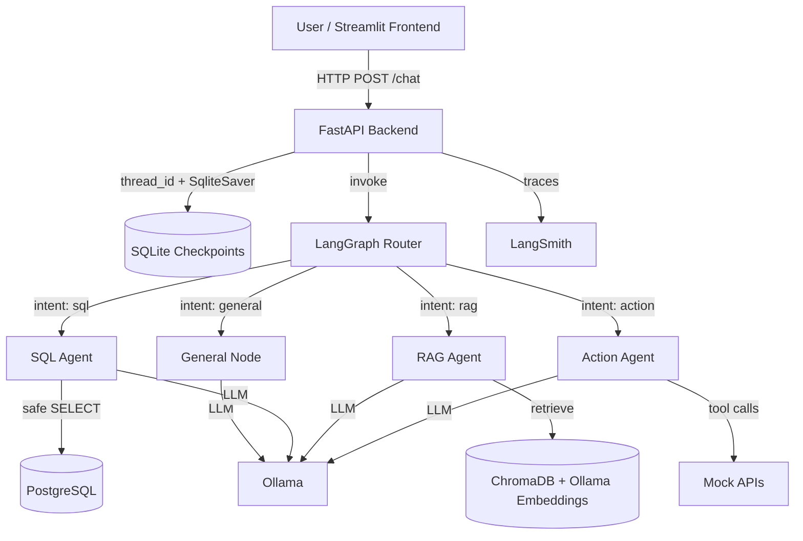

# Dispatch AI — Architecture

## System Overview

Dispatch AI is a multi-agent customer-support system. A user asks a question through the Streamlit frontend or directly via the FastAPI backend. The backend runs a LangGraph agent that classifies the question's intent and routes it to one of four specialist agents: SQL, RAG, action, or general. Each agent uses a local Ollama model and the appropriate data source or tool.

## Architecture Diagram

## Component Descriptions

| Component | Responsibility |
|-----------|----------------|
| **Streamlit Frontend** | Chat UI with session ID, streaming/non-streaming toggle, example questions, and source/intent expanders. |
| **FastAPI Backend** | Exposes `/health`, `/chat`, `/chat/stream`, `/sessions/{id}/history`, and `/metrics`. Handles CORS, rate limiting, request logging, response caching, and metrics aggregation. |
| **LangGraph Router** | Classifies the latest user message into `sql`, `rag`, `action`, or `general` and routes to the matching node. |
| **SQL Agent** | Generates, validates, executes, and summarizes read-only PostgreSQL queries. |
| **RAG Agent** | Embeds the query, retrieves relevant knowledge-base chunks from ChromaDB, filters by cosine distance, and answers with grounded sources. |
| **Action Agent** | Uses LLM tool calling to choose between weather lookup, notification, and support-ticket creation. |
| **General Node** | Handles greetings, small talk, and anything outside the specialist domains. |
| **Ollama** | Runs local `llama3.1` for generation and `nomic-embed-text` for embeddings. |
| **PostgreSQL** | Stores `customers`, `orders`, and `support_tickets`. |
| **ChromaDB** | Vector store for the markdown knowledge base. |
| **SqliteSaver** | Persists conversation state per `session_id`. |
| **LangSmith** | Optional tracing and evaluation dashboard. |

## Data Flow

1. The user sends a message to `/chat` or `/chat/stream` with a `session_id`.
2. FastAPI validates the request and runs the compiled LangGraph.
3. The router node classifies intent using the conversation history as context.
4. The matching specialist node executes:
   - **SQL**: generates a query, runs keyword safety checks, executes it, and formats results.
   - **RAG**: embeds the query, searches ChromaDB, drops low-confidence matches, and synthesizes an answer with source titles.
   - **Action**: chooses and invokes a tool via the LLM.
   - **General**: asks the LLM directly.
5. The final assistant message, intent, and any sources are returned as JSON or as Server-Sent Events.
6. The graph state is checkpointed to SQLite for multi-turn memory.
7. Endpoint metrics are updated: total requests, latency, token estimate, and cost estimate.

## Design Decisions and Trade-offs

- **Local-first inference with Ollama** eliminates API costs and network latency but requires sufficient CPU/GPU resources and model management.
- **Single LLM for routing and answers** keeps the stack simple. A dedicated smaller/faster classifier model would reduce routing latency.
- **SQLite conversation memory** via `SqliteSaver` is easy to deploy but not horizontally scalable; a cloud deployment would swap in a shared checkpointer store.
- **Response caching (`functools.lru_cache`)** speeds up repeated identical queries. The cache is keyed by `(message, session_id)` so context-sensitive answers are not shared across sessions.
- **SQL safety** is enforced by regex/keyword checks before execution. This is lightweight but not a complete sandbox; production should also use a read-only database user and query whitelisting.
- **Token and cost estimates** are based on a simple character-per-token heuristic. Ollama is free locally, so cost is `$0` unless `TOKEN_COST_PER_1K` is set for an external model.

## Monitoring and Observability

- **`/metrics`** returns aggregate request count, average latency, total tokens, intent distribution, and a configurable cost estimate.
- **Centralized logging** captures request durations, intents, and errors at each layer.
- **LangSmith** records full graph traces when `LANGCHAIN_TRACING_V2=true` and `LANGCHAIN_API_KEY` are configured.
- **`eval/run_eval.py`** runs a suite of intent, SQL, RAG, and action test cases and writes a timestamped results JSON.
